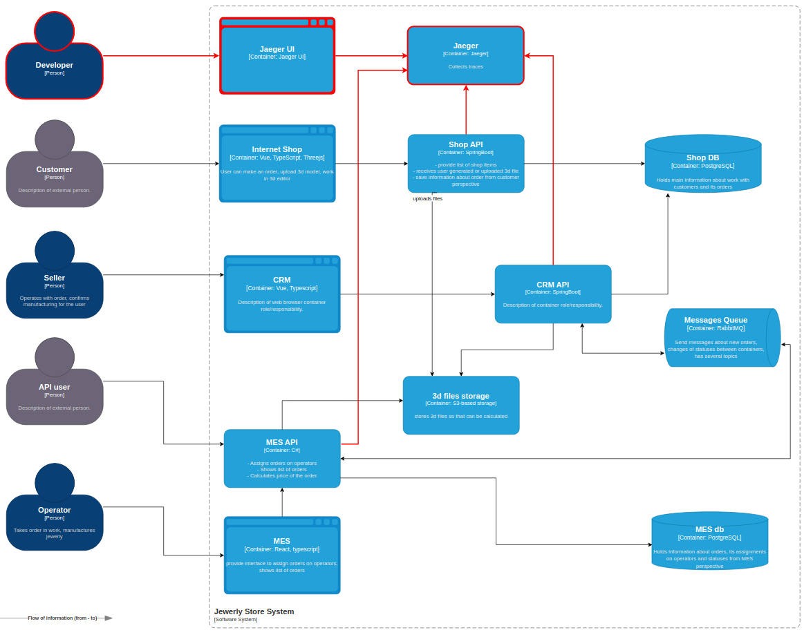

# Задание 3. Трейсинг

1. **Проанализируйте систему компании и C4-диаграмму в контексте планирования трейсинга.** Напишите и выделите на схеме системы, которые следует покрыть трейсингом. Для этого идентифицируйте места, где заказ может «сломаться» или зависнуть. Составьте список данных, которые должны попадать в трейсинг    
2. **Добавьте в файл раздел «Мотивация».** Напишите здесь, почему в систему нужно добавить трейсинг и что это даст компании. Опишите возможные три-пять технические и бизнес-метрики решения, на которые повлияет внедрение трейсинга.
3. **Добавьте раздел «Предлагаемое решение».** Опишите, как и с помощью каких технологий будет реализован трейсинг, какие компоненты нужно внедрить или доработать. Отразите компоненты и новые связи на схеме. Скачайте [диаграмму контейнеров](https://code.s3.yandex.net/software-architect/jewerly_c4_model.drawio?etag=3fd9b7afd2890dfd40ae2217e418e9fa) Александрита» в модели C4. Доработайте диаграмму, исходя из вашего решения: отразите на ней новые компоненты и связи. Новые элементы выделяйте красным цветом — так ревьюеру будет проще проверить вашу работу. Когда схема будет готова, добавьте ссылку на неё в раздел «Предлагаемое решение».
4. **Добавьте раздел «Компромиссы».** Опишите, в каких случаях трейсинг не принесёт пользы или пока невозможен, или его реализация обойдётся слишком дорого. Например, сложно заставить проприетарную систему отдавать метрики в нужном формате, может потребоваться дорогостоящая доработка.    
5. **Проработайте аспекты безопасности.** Опишите, какие меры для предотвращения несанкционированного доступа будут предусмотрены для системы трейсинга внутри компании и снаружи если это требуется. Например: «Внедрение аутентификации — зайти в систему смогут только сотрудники компании с актуальной учетной записью и ролью “Поддержка”».
6. **Дополнительное задание.** Спроектируйте и опишите в разделе «Предлагаемое решение», как будет реализованы автоматический мониторинг процесса прохождения заказа, полученные из данных трейсинга, и алертинг. Обновите последний вариант диаграммы, который вы подготовили для этого раздела, — отразите на нём необходимые связи. Новые элементы выделяйте зелёным цветом. Добавьте отдельную ссылку на новый вариант диаграммы.

## 1. Анализ

Трейсинг (трассировка) — это метод анализа работы распределённых систем, который позволяет отслеживать путь запроса через множество сервисов, микросервисов, баз данных и других компонентов.

| Статус заказа             | Описание                                                                                                                            | Связь компонентов               | Данные трейсинга                     |
| ------------------------- | ----------------------------------------------------------------------------------------------------------------------------------- | ------------------------------- | ------------------------------------ |
| `INITIATED`               | Пользователь завёл новый заказ или положил товары в пустую корзину                                                                  | `Internet Shop` → `Shop API`    | ID заказа, ID пользователя           |
|                           |                                                                                                                                     | `Shop API` → `Shop DB`          | ID заказа, SQL запрос                |
| `FILE_UPLOADED`           | Пользователь загрузил файл с 3D-моделью или создал его с помощью конструктора                                                       | `Internet Shop` → `Shop API`    | ID заказа, ID пользователя, FileName |
|                           |                                                                                                                                     | `Shop API` → `3d files storage` | ID заказа, ID пользователя, FileName |
|                           |                                                                                                                                     | `Shop API` → `Shop DB`          | ID заказа, SQL запрос                |
| `SUBMITTED`               | Пользователь нажал на кнопку «Сделать заказ»                                                                                        | `Internet Shop` → `Shop API`    | ID заказа, ID пользователя           |
|                           |                                                                                                                                     | `Shop API` → `Shop DB`          | ID заказа, SQL запрос                |
|                           | Фоновое задание обнаруживает новый заказ в статусе `SUBMITTED` и отправляет запрос на расчет стоимости в `MES API` через `RabbitMQ` | `CRM API` → `Message Queue`     | ID заказа                            |
| `PRICE_CALCULATED`        | Cистема посчитала стоимость заказа.                                                                                                 | `Message Queue` → `MES API`     | ID заказа, FileName                  |
|                           |                                                                                                                                     | `MES API` → `3d files storage`  | ID заказа,  FileName                 |
|                           |                                                                                                                                     | `MES API` → `MES DB`            | ID заказа, SQL запрос                |
|                           | Уведомление о завершении расчета стоимости в `CRM API` через `RabbitMQ`                                                             | `MES API` → `Message Queue`     | ID заказа                            |
|                           |                                                                                                                                     | `Message Queue` → `CRM API`     | ID заказа                            |
|                           |                                                                                                                                     | `CRM API` → `Shop DB`           | ID заказа, SQL запрос                |
| `MANUFACTURING_APPROVED`  | Продавец подтвердил заказ. Заказ можно отдавать в производство.                                                                     | `CRM` → `CRM API`               | ID заказа, ID пользователя           |
|                           |                                                                                                                                     | `CRM API` → `Shop DB`           | ID заказа, SQL запрос                |
|                           | Уведомление о подтверждении заказа в `MES API` через `RabbitMQ`                                                                     | `CRM API` → `Message Queue`     | ID заказа                            |
|                           |                                                                                                                                     | `Message Queue` → `MES API`     | ID заказа                            |
|                           |                                                                                                                                     | `MES API` → `MES DB`            | ID заказа, SQL запрос                |
| `MANUFACTURING_STARTED`   | Оператор взял заказ в работу.                                                                                                       | `MES` → `MES API`               | ID заказа, ID пользователя           |
|                           |                                                                                                                                     | `MES API` → `MES DB`            | ID заказа, SQL запрос                |
| `MANUFACTURING_COMPLETED` | Оператор выполнил заказ.                                                                                                            | `MES` → `MES API`               | ID заказа, ID пользователя           |
|                           |                                                                                                                                     | `MES API` → `MES DB`            | ID заказа, SQL запрос                |
| `PACKAGING`               | Оператор начал упаковывать заказ.                                                                                                   | `MES` → `MES API`               | ID заказа, ID пользователя           |
|                           |                                                                                                                                     | `MES API` → `MES DB`            | ID заказа, SQL запрос                |
| `SHIPPED`                 | Заказ отправлен покупателю.                                                                                                         | `MES` → `MES API`               | ID заказа, ID пользователя           |
|                           |                                                                                                                                     | `MES API` → `MES DB`            | ID заказа, SQL запрос                |
|                           | Уведомление о завершении заказа в `CRM API` через `RabbitMQ`                                                                        | `MES API` → `Message Queue`     | ID заказа                            |
| `CLOSED`                  | Заказ завершён. Он закрывается после получения сообщения от транспортной компании или вручную.                                      | `Message Queue` → `CRM API`     | ID заказа                            |
|                           |                                                                                                                                     | `CRM API` → `Shop DB`           | ID заказа, SQL запрос                |

## 2. Мотивация

Трейсинг позволит идентифицировать причины срыва сроков исполнения заказов, а также обнаружить узкие места, влияющие на отзывчивость и быстродействие системы. Сократить время, необходимое для локализации и устранения неисправностей, тем самым повысив качество обслуживания пользователей.

| Метрика                                                       | Влияние трейсинга                                                                                                                                                  |
| ------------------------------------------------------------- | ------------------------------------------------------------------------------------------------------------------------------------------------------------------ |
| % заказов с отклонением срока исполнения                      | Позволит выявить причины срыва сроков, скорректировать работу системы и персонала, значительно сократив % заказов с отклонением срока исполнения.                  |
| Количество жалоб пользователей                                | Сокращение % заказов с отклонением срока исполнения приведет к уменьшению количества жалоб пользователей.                                                          |
| Время отклика на обращение пользователя в адрес тех.поддержки | Трейсинг позволит сократить время на локализацию  и идентификацию причин возникающих проблем, что приведет к сокращению времени отклика на обращение пользователя. |

## 3. Предлагаемое решение

1. Развернуть и настроить `Jaeger`
2. Обеспечить экспорт трейсов с использованием `OpenTelemetry SDK`, доработав `MES API`, `Shop API`, `CRM API`.

[Диаграмма компонентов C4](jewerly_c4_model_tracing.drawio)

## 4. Компромиссы

Трейсинг — это баланс между степенью детализации и производительностью, пользой и стоимостью. Ширина и глубина покрытия трейсингом должны быть достаточны для решения поставленной задачи в разумные сроки и с разумным бюджетом.

Нет смысла дорабатывать PostgreSQL, RabbitMQ, S3-storage так, как такой уровень детализации не требуется для идентификации причины срыва сроков исполнения заказов, а также обнаружения узких мест, влияющих на отзывчивость и быстродействие системы. Кроме того такая доработка была бы экономически нецелесообразна.

## 5. Безопасность решения

1. *Контроль доступа к Jaeger*. 
	- Вход по логину паролю с аутентификацией через корпоративную IAM-систему.
	- Ограничение доступа по IP.
2. *Шифрование информационных потоков Jaeger*. Применение TLS при передаче данных.
3. *Очистка персональных и иных чувствительных данных в трейсах*.
	- Применение `OpenTelemetry Processors` для автоматизации маскирования данных.
	- Код-ревью.