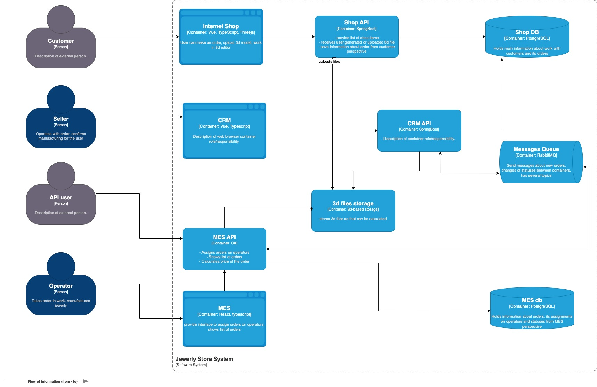
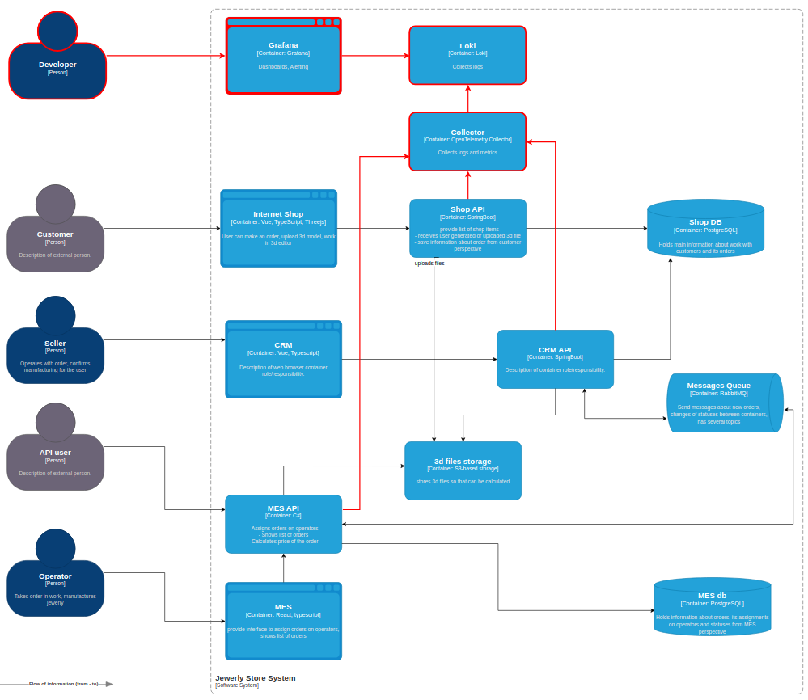

# Задание 4. Логирование

1. **Проанализируйте систему компании и C4-диаграмму в контексте планирования логирования.** Опишите, какие логи нужно собирать и отметьте на схеме, из каких систем требуется сбор логов. Составьте список необходимых логов с уровнем INFO. Например, изменение статуса заказа. Логируем время, идентификатор покупателя, номер заказа. Напишите, будете ли вы использовать другие уровни логирования и при каких обстоятельствах.
2. **Добавьте в файл раздел «Мотивация».** Напишите здесь, почему в систему нужно добавить логирование и что это даст компании. Опишите три-пять технические и бизнес-метрики решения, на которые может повлиять внедрение логирования. Команда не сможет реализовать единовременно логирование и трейсинг всех выделенных для этого систем. Поэтому опишите, для каких систем нужно настраивать логирование и трейсинг в первую очередь и почему.
3. **Добавьте раздел «Предлагаемое решение».** Опишите, как и с помощью каких технологий будет реализовано логирование, какие компоненты нужно внедрить или доработать. Отразите компоненты и новые связи на схеме. Проработайте политику безопасности в отношении логов — как будет происходить работа с чувствительными данными, кто будет иметь доступ к логам. Проработайте политику хранения в отношении логов — будет ли это отдельный индекс под систему, сколько они будут храниться и какого размера будут.
4. **Проработайте необходимые мероприятия для превращения системы сбора логов в систему анализа логов:** Нужно ли настроить какой-то алертинг? Нужно ли искать аномалии? Например, было четыре записи о создании заказов и за секунду их стало 10 000. Возможно, происходит DDoS-атака конкурентами.

## 1. Анализ

Существует 6 уровней логов:
- `FATAL` — отказ сервиса или оборудования.
- `ERROR` — ошибочное состояние.
- `WARN` — состояние, которое близко к нестандартному поведению системы.
- `INFO` — штатное поведение сиситемы.
- `DEBUG` — обычно используют для отладки. На продакшн-серверах их не используют, чтобы не засорять логи лишней информацией.
- `TRACE` — обычно используют в среде разработки и для отладки в тестовом окружении.

Для компонентов системы компании Александрит предлагается использовать уровни `FATAL`, `ERROR`, `WARN`, `INFO` в исключительных случаях на время сбора детальной информации `DEBUG`.

### Логи `Shop API`

| Событие                                                               | Уровень лога | Данные                                                      |
| --------------------------------------------------------------------- | ------------ | ----------------------------------------------------------- |
| Изменение статуса заказа на `INITIATED` /`FILE_UPLOADED` /`SUBMITTED` | INFO         | Дата и время, ID заказа, ID пользователя                    |
| Выполнен запрос к `Shop DB`                                           | DEBUG        | Дата и время, ID заказа, Шаблон SQL-запроса без параметров  |
| Файл сохранен в `3d files storage`                                    | INFO         | Дата и время, ID заказа, Наименование файла                 |
| Ошибка изменения статуса заказа                                       | ERROR        | Дата и время, ID заказа                                     |
| Не доступна база данных `Shop DB`                                     | FATAL        | Дата и время                                                |
| Не доступно объектное хранилище `3d files storage`                    | FATAL        | Дата и время                                                |
| Пользователь загрузил файл старого формата                            | WARN         | Дата и время, ID заказа, Наименование файла, Версия формата |
### Логи `CRM API`

| Событие                                                                            | Уровень лога | Данные                                                     |
| ---------------------------------------------------------------------------------- | ------------ | ---------------------------------------------------------- |
| Изменение статуса заказа на `PRICE_CALCULATED` /`MANUFACTURING_APPROVED` /`CLOSED` | INFO         | Дата и время, ID заказа, ID пользователя                   |
| Отправлен запрос на расчет стоимости в `MES API` через `RabbitMQ`                  | INFO         | Дата и время, ID заказа, ID сообщения                      |
| Получено уведомление о завершении расчета стоимости                                | INFO         | Дата и время, ID заказа, ID сообщения                      |
| Выполнен запрос к `Shop DB`                                                        | DEBUG        | Дата и время, ID заказа, Шаблон SQL-запроса без параметров |
| Отправлено уведомление о подтверждении заказа в `MES API` через `RabbitMQ`         | INFO         | Дата и время, ID заказа, ID сообщения                      |
| Получено уведомление о завершении заказа                                           | INFO         | Дата и время, ID заказа, ID сообщения                      |
| Ошибка изменения статуса заказа                                                    | ERROR        | Дата и время, ID заказа                                    |
| Не доступна база данных `Shop DB`                                                  | FATAL        | Дата и время                                               |
| Не доступен брокер `Message Queue`                                                 | FATAL        | Дата и время                                               |
### Логи `MES API`

| Событие                                                                                                | Уровень лога | Данные                                                     |
| ------------------------------------------------------------------------------------------------------ | ------------ | ---------------------------------------------------------- |
| Изменение статуса заказа на `MANUFACTURING_STARTED` /`MANUFACTURING_COMPLETED` /`PACKAGING` /`SHIPPED` | INFO         | Дата и время, ID заказа, ID пользователя                   |
| Получен запрос на расчет стоимости                                                                     | INFO         | Дата и время, ID заказа, ID сообщения                      |
| Отправлено уведомление о завершении расчета стоимости                                                  | INFO         | Дата и время, ID заказа, ID сообщения                      |
| Получено уведомление о подтверждении заказа                                                            | INFO         | Дата и время, ID заказа, ID сообщения                      |
| Выполнен запрос к `MES DB`                                                                             | DEBUG        | Дата и время, ID заказа, Шаблон SQL-запроса без параметров |
| Отправлено уведомление о завершении заказа                                                             | INFO         | Дата и время, ID заказа, ID сообщения                      |
| Ошибка изменения статуса заказа                                                                        | ERROR        | Дата и время, ID заказа                                    |
| Не доступна база данных `MES DB`                                                                       | FATAL        | Дата и время                                               |
| Не доступен брокер `Message Queue`                                                                     | FATAL        | Дата и время                                               |
### Приоритеты внедрения

1. `MES API` — большая часть этапов жизненного цикла заказа обрабатывается в данной системе.
2. `CRM API` — присутствует асинхронная коммуникация с `MES API`, возможна потеря сообщений.
3. `Shop API`

## 2. Мотивация

Логи позволят упростить анализ проблем и снизить время ответа на обращения пользователей в техническую поддержку.

| Метрика                                                       | Влияние логирования                                                                                                                   |
| ------------------------------------------------------------- | ------------------------------------------------------------------------------------------------------------------------------------- |
| Время отклика на обращение пользователя в адрес тех.поддержки | Логирование позволит сократить время на анализ проблем, что приведет к сокращению времени отклика на обращение пользователя.          |
| Количество инцидентов за определенный период                  | Наличие логов позволит систематизировать работу над инцидентами, исправляя причины проблем, сократить в конечном итоге их количество. |
| Количество жалоб пользователей                                | Систематическая работа над инцидентами приведет к сокращению количества жалоб пользователей.                                          |
## 3. Предлагаемое решение

1. Развернуть и настроить `OpenTelemetry Collector`
2. Развернуть и настроить `Loki`
3. Развернуть и настроить `Grafana`
4. Обеспечить экспорт логов с использованием `OpenTelemetry SDK`, доработав `MES API`, `Shop API`, `CRM API`.

[Диаграмма компонентов C4](jewerly_c4_model_logging.drawio)
### Безопасность решения

1. *Контроль доступа к Grafana*. 
	- Вход по логину паролю с аутентификацией через корпоративную IAM-систему.
	- Ограничение доступа по IP.
2. *Шифрование информационных потоков*. Применение TLS при передаче данных.
3. *Очистка персональных и иных чувствительных данных в логах*.
	- Применение `OpenTelemetry Processors` для автоматизации маскирования данных.
	- Код-ревью.
### Политика хранения

Для каждого компонента системы требуется настроить отдельный индекс, с временем хранения три месяца.

## 4. Организация системы анализа логов

Необходимо разработать и внедрить регламент реагирования на критические события. Настроить систему оповещений (alerting) для отправки уведомлений ответственным лицам.

| Событие                                                             | Уровень лога | Ответственный                         |
| ------------------------------------------------------------------- | ------------ | ------------------------------------- |
| Ошибка изменения статуса заказа                                     | ERROR        | Дежурный разработчик                  |
| Не доступна база данных `Shop DB`                                   | FATAL        | Дежурный DevOps                       |
| Не доступно объектное хранилище `3d files storage`                  | FATAL        | Дежурный DevOps                       |
| Не доступен брокер `Message Queue`                                  | FATAL        | Дежурный DevOps                       |
| Не доступна база данных `MES DB`                                    | FATAL        | Дежурный DevOps                       |
| Количество ошибок уровня `ERROR` за период превышает N              | ERROR        | Дежурный разработчик, Дежурный DevOps |
| Нет записей в лог в течение заданного периода                       |              | Дежурный DevOps                       |
| Значительное увеличение количества записей в лог за заданный период |              | Дежурный DevOps                       |
