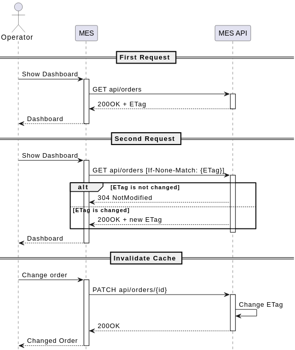
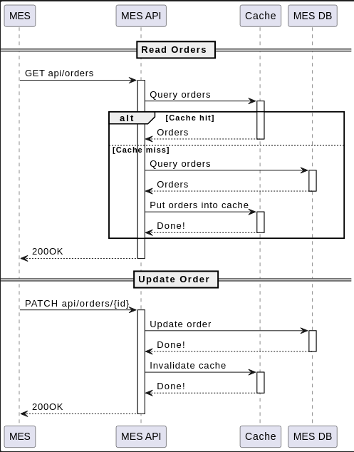

# Задание 5. Кеширование

1. **Проанализируйте диаграмму системы и её описание.** Решите, какую часть системы имеет смысл закешировать.
2. **Добавьте в файл раздел «Мотивация».** Опишите здесь, почему вы предлагаете внедрить кеширование, какие проблемы оно должно решить и какие элементы системы вы планируете включить в кеширование.
3. **Добавьте раздел «Предлагаемое решение».** Определите, какое кеширование вы будете внедрять — клиентское или серверное. Объясните, почему, на ваш взгляд, нужно использовать именно его. Если вы решите куда-то внедрить серверное кеширование, то поясните, какой паттерн будете применять — Cache-Aside, Write-Through или Refresh-Ahead. А также объясните, почему вы выбрали этот паттерн и почему остальные паттерны не подойдут или покажут себя хуже.
4. **Нарисуйте [диаграмму последовательности действий (Sequence diagram)](https://ru.wikipedia.org/wiki/%D0%94%D0%B8%D0%B0%D0%B3%D1%80%D0%B0%D0%BC%D0%BC%D0%B0_%D0%BF%D0%BE%D1%81%D0%BB%D0%B5%D0%B4%D0%BE%D0%B2%D0%B0%D1%82%D0%B5%D0%BB%D1%8C%D0%BD%D0%BE%D1%81%D1%82%D0%B8).** Отобразите там, как проходит операция чтения списка заказов и запись об изменении статуса заказа. Там же опишите процесс кеширования с указанием всех сущностей, которые участвуют в кешировании. Добавьте диаграмму в раздел «Предлагаемое решение».
5. **В блоке «Предлагаемое решение» опишите стратегию инвалидации кеша, которую вы планируете использовать.** Объясните, какую стратегию инвалидации вы предлагаете (временную, по ключу, программную или другие), почему она подойдёт и почему не подойдут другие стратегии. Не всегда очевидно, какое решение лучше. Чтобы выбрать оптимальный вариант, можете сделать сравнительный анализ в виде таблицы.

## 1. Анализ

Участились жалобы от операторов: когда они заходят на первую страницу MES, система долго прогружается. На первой странице отображается список заказов в работе по статусам — это дашборд с фильтром. Раньше страница показывала все заказы, но это тормозило загрузку. Команда сделала фильтр по статусам и пагинацию, но это не помогло. Операторам важно видеть самые новые заказы, потому что от этого зависит их вознаграждение, — кто взял заказ, тот и получит оплату.

Операторы часто просматривают дашбоард заказов, что приводит к высокой нагрузке на базу данных и увеличению времени отклика. Для решения проблемы быстродействия дашборда предлагается реализовать кеширование в MES-приложении. 

## 2. Мотивация

Кеширование — это временное сохранение часто используемых данных в быстродоступном хранилище для ускорения работы системы. Кеширование позволяет снизить нагрузку на источники данных и уменьшить время отклика на запрос. 

## 3. Предлагаемое решение

Требуется реализовать клиентское и серверное кеширование в MES-приложении. Комбинация указанных методов позволит сократить нагрузку на `MES API` и `MES DB`. 

### Клиентское кеширование

Клиентское кеширование предлагается реализовать применив conditional request, используя заголовки [`ETag`](https://developer.mozilla.org/en-US/docs/Web/HTTP/Reference/Headers/ETag) и [`If-None-Match`](https://developer.mozilla.org/en-US/docs/Web/HTTP/Reference/Headers/If-None-Match) для проверки актуальности запрашиваемого ресурса.

[Диаграмма последовательности для клиентского кеширования](client-cache.puml)

### Серверное кеширование

Существует пять паттернов для реализации кеширования на стороне сервера. 

| Паттерн       | Механизм работы                                                        | Плюсы                                                                                                                                      | Минусы                                                                                                                                   |
| ------------- | ---------------------------------------------------------------------- | ------------------------------------------------------------------------------------------------------------------------------------------ | ---------------------------------------------------------------------------------------------------------------------------------------- |
| Cache-Aside   | - Приложение обновляет кэш - Операции чтения                        | 1. Устойчивость к сбоям кэша 2. Модель данных в кеше может отличаться от модели данных в БД                                             | 1. Высокое время запроса, пока кеш пуст 2. Неконсистентность данных                                                                   |
| Read-Through  | - БД обновляет кеш - Операции чтения                                | 1. Меньшая сложность приложения — низкая вероятность ошибок                                                                                | 1. Кеш-промах при первом запросе 2. Модель данных в коде должна соответствовать модели данных в базе 3. Чувствительность к ошибкам |
| Refresh-ahead | - Операции чтения                                                      | 1. Низкая стоимость 2. Высокая чувствительность к задержкам 3. Согласованность записей кеша, к которым часто обращаются пользователи | 1. При обновлении кеша могут быть ошибки и нужна качественная система мониторинга                                                        |
| Write-Through | - Синхронное обновление БД - БД обновляет кеш - Операции записи  | 1. Низкая стоимость 2. Консистентность данных                                                                                           | 1. Задержки в передаче данных                                                                                                            |
| Write-Behind  | - Асинхронное обновление БД - БД обновляет кеш - Операции записи | 1. Низкая стоимость 2. Консистентность данных 3. Высокая скорость передачи данных                                                    | 1. Потенциальные ошибки при обновлении базы                                                                                              |
Для серверного кеширования будет применен `Cache-Aside`. Данный паттерн прост в реализации, гибок в части выбора стратегии инвалидации и обеспечит устойчивость к сбоям кэша. Кроме того, модель данных в кеше при данном подходе может отличаться от модели данных в БД. Это позволит выполнять запрос на выборку заказов для дашборда к БД, объединяющий несколько таблиц, и сохранять результат в кеше под одним ключом. 

[Диаграмма последовательности для серверного кеширования](server-cache-aside.puml)

### Стратегия инвалидации кеша

В качестве стратегии будет использована инвалидация на основе изменений. Выбранный способ прост в реализации и позволит содержать данные дашборда в актуальном состоянии.

| Способ инвалидации                  | Описание способа                                                                | Обоснование выбора                                                                                                                                                                                                                                                                                                    |
| ----------------------------------- | ------------------------------------------------------------------------------- | --------------------------------------------------------------------------------------------------------------------------------------------------------------------------------------------------------------------------------------------------------------------------------------------------------------------- |
| Временная инвалидация               | Данные имеют определенный срок действия                                         | Этот способ не подходит, так как данные о заказах обновляются по запросам пользователей и смежных систем. Определить срок действия этапа жизненного цикла заказа не представляется возможным.                                                                                                                         |
| Инвалидация, основанная на запросах | Обеспечивает актуальность данных в зависимости от активности пользователей      | Этот способ не подходит, так как пользователи MES-системы не единственные акторы влияющие на изменение данных о заказах.                                                                                                                                                                                              |
| Инвалидация на основе изменений     | Для обновления данных в реальном времени                                        | Этот способ подходит. Данные для дашборда представляют из себя коллекцию заказов, находящихся в определенном статусе. Данный способ позволит при изменении любого заказа инвалидировать кеш с коллекцией заказов.                                                                                                     |
| Программная инвалидация             | Позволяет гибко управлять инвалидацией кеша в соответствии с логикой приложения | Этот способ подходит и позволит реализовать наиболее точный алгоритм инвалидации. Например сбрасывать кеш с данными для дашборда, только в том случае если обновляются только те поля заказа, что используются для вывода на дашборде. Однако данный способ более трудозатратен, чем инвалидация на основе изменений. |
| Инвалидация по ключу                | Позволяет точно определять данные, которые нуждаются в обновлении               | Этот способ не подходит, так как данные для дашборда представляют из себя коллекцию заказов, находящихся в определенном статусе.                                                                                                                                                                                      |
